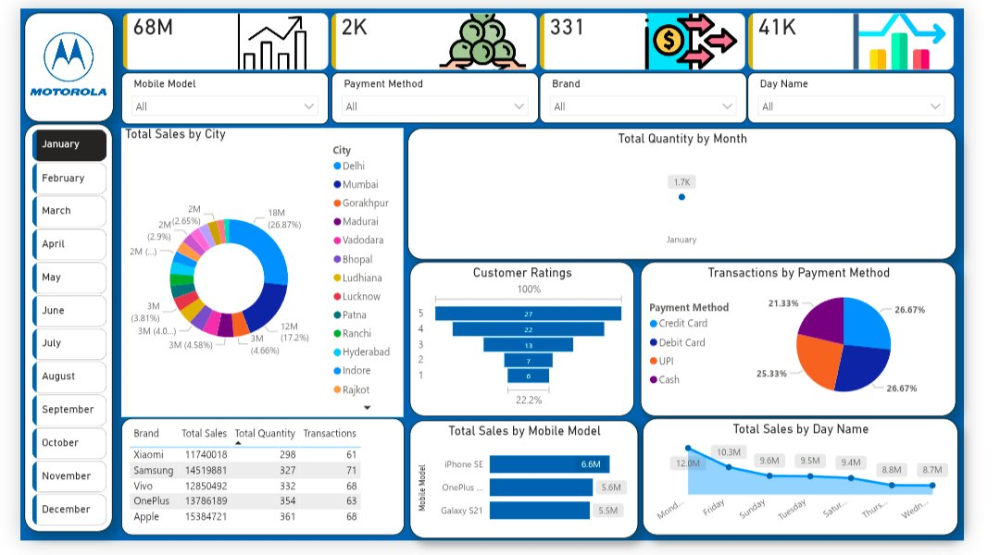

# 📊 Power BI Dashboards — Prerna Rai

A collection of interactive Power BI dashboards demonstrating end-to-end dashboard development — from raw data to business-ready visuals with KPIs, slicers, DAX measures, and multi-visual layouts.

---

## Projects

### 📱 [Mobile Sales Dashboard](./mobile-sales-dashboard/)

> Sales performance across Indian cities, brands, payment methods, and time periods. Features KPI cards, donut chart, pie chart, bar charts, area chart, and dynamic slicers.

---

## Tools & Skills Demonstrated

- **Power BI Desktop** — report pages, visuals, slicers, KPI cards
- **Chart Types** — donut, pie, bar, line, area charts, data tables
- **Techniques** — dynamic filtering, time-based analysis, brand/model segmentation, payment analysis

---

## Author

**Prerna Rai** — Data Analyst | SQL · Power BI · Tableau · Excel · Python  
📧 prernarai200q@gmail.com  
🔗 [LinkedIn](https://linkedin.com/in/prerna-rai-b3a6a828a) · [GitHub](https://github.com/prernarai07)
